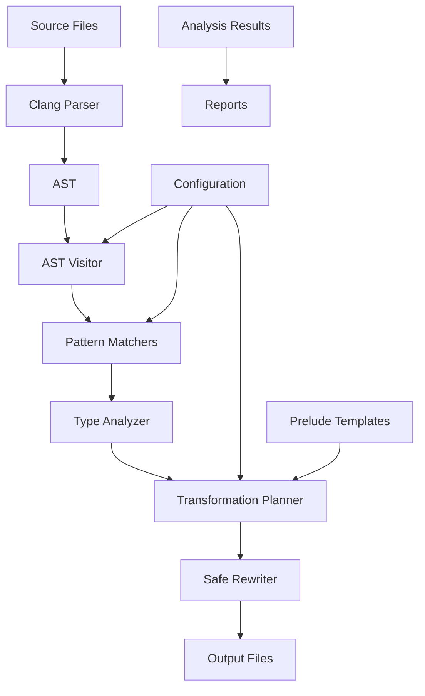

# OptiWeave Architecture

This document describes the high-level architecture and design principles of OptiWeave.

## Overview

OptiWeave is built on a modular, layered architecture that separates concerns and allows for easy extension and maintenance. The system is designed around the LLVM/Clang LibTooling infrastructure while providing a higher-level, more user-friendly interface.

## Architecture Layers

```
┌─────────────────────────────────────────────────────────────┐
│                    Command Line Interface                   │
│                    (src/main.cpp)                          │
├─────────────────────────────────────────────────────────────┤
│                    High-Level API Layer                     │
│                 (core/transformer.hpp)                     │
├─────────────────────────────────────────────────────────────┤
│     AST Processing     │   Safe Rewriting   │   Analysis   │
│   (core/ast_visitor)   │   (core/rewriter)  │  (analysis/) │
├─────────────────────────────────────────────────────────────┤
│           Pattern Matching    │    Type Analysis           │
│          (matchers/)          │    (matchers/type_*)       │
├─────────────────────────────────────────────────────────────┤
│                    Utility Layer                           │
│                   (utils/*)                                │
├─────────────────────────────────────────────────────────────┤
│                  Clang LibTooling                          │
├─────────────────────────────────────────────────────────────┤
│                    LLVM Core                               │
└─────────────────────────────────────────────────────────────┘
```

## Core Components

### 1. AST Visitor (`core/ast_visitor.hpp`)

**Responsibility**: Traverse and analyze the Abstract Syntax Tree.

**Key Features**:
- Post-order traversal to prevent interstitial rewriting issues
- Context-aware expression analysis
- Template dependency detection
- Configuration-driven transformation decisions

**Design Patterns**:
- Visitor Pattern for AST traversal
- Strategy Pattern for different operator types
- Template Method Pattern for transformation pipeline

### 2. Safe Rewriter (`core/rewriter.hpp`)

**Responsibility**: Manage source code transformations safely.

**Key Features**:
- Conflict detection between replacements
- Atomic transformation operations
- Transaction-based changes with rollback capability
- Efficient source location tracking

**Design Patterns**:
- Command Pattern for replacements
- Transaction Pattern for atomic operations
- Observer Pattern for conflict detection

### 3. Transformer (`core/transformer.hpp`)

**Responsibility**: High-level transformation orchestration.

**Key Features**:
- File and project-level transformation management
- Progress reporting and error handling
- Integration with build systems
- Batch processing capabilities

**Design Patterns**:
- Facade Pattern for simplified API
- Factory Pattern for action creation
- Template Method Pattern for transformation workflow

### 4. Matchers (`matchers/`)

**Responsibility**: Pattern matching and AST node identification.

**Key Features**:
- AST pattern matching using Clang's ASTMatchers
- Type-aware expression filtering
- Context-sensitive matching rules
- Extensible matcher combinators

**Design Patterns**:
- Matcher Pattern (obviously)
- Composite Pattern for complex matchers
- Builder Pattern for matcher construction

### 5. Analysis (`analysis/`)

**Responsibility**: Code analysis and transformation planning.

**Key Features**:
- Operator usage detection and classification
- Template dependency analysis
- Performance impact estimation
- Transformation opportunity identification

**Design Patterns**:
- Visitor Pattern for analysis traversal
- Strategy Pattern for different analysis types
- Observer Pattern for result collection

### 6. Type System (`matchers/type_matchers.hpp`)

**Responsibility**: C++ type system understanding and manipulation.

**Key Features**:
- Template specialization detection
- Operator overload resolution
- SFINAE-based type trait generation
- Cross-platform type compatibility

**Design Patterns**:
- Type Traits Pattern
- CRTP (Curiously Recurring Template Pattern)
- SFINAE (Substitution Failure Is Not An Error)

## Data Flow

### Transformation Pipeline

1. **Input Processing**
   - Parse command line arguments
   - Load configuration and prelude templates
   - Validate input files and compilation database

2. **AST Analysis**
   - Parse source files using Clang frontend
   - Build AST with full semantic information
   - Run analysis passes to identify transformation opportunities

3. **Pattern Matching**
   - Apply AST matchers to find target expressions
   - Classify expressions by type and context
   - Filter based on configuration and safety rules

4. **Transformation Planning**
   - Generate replacement operations
   - Check for conflicts and dependencies
   - Optimize transformation order

5. **Code Generation**
   - Apply source transformations
   - Generate instrumentation code
   - Preserve formatting and comments

6. **Output Generation**
   - Write transformed files
   - Generate reports and statistics
   - Handle backup and recovery

### Information Flow



## Design Principles

### 1. Modularity

Each component has a single, well-defined responsibility and minimal dependencies on other components. This allows for:
- Independent testing and development
- Easy replacement of components
- Clear interfaces and contracts

### 2. Safety

The system prioritizes correctness and safety over performance:
- Extensive validation of transformations
- Atomic operations with rollback capability
- Comprehensive error handling and reporting

### 3. Extensibility

The architecture supports easy extension without modifying core components:
- Plugin-style matcher system
- Configurable transformation rules
- Template-based code generation

### 4. Performance

Despite the safety focus, the system is designed for good performance:
- Parallel processing where possible
- Efficient data structures
- Minimal memory allocation in hot paths

### 5. Maintainability

The codebase is designed to be maintainable long-term:
- Clear separation of concerns
- Comprehensive documentation
- Extensive test coverage
- Modern C++ practices

## Memory Management

### RAII Principles

All resources are managed using RAII (Resource Acquisition Is Initialization):
- Smart pointers for dynamic allocation
- Stack-based objects where possible
- Automatic cleanup on scope exit

### Memory Safety

- No raw pointers in public interfaces
- Const-correctness throughout
- Move semantics for large objects
- Careful lifetime management for AST nodes

## Error Handling

### Error Categories

1. **Configuration Errors**: Invalid settings, missing files
2. **Parsing Errors**: Invalid C++ code, missing headers
3. **Transformation Errors**: Conflicting replacements, invalid contexts
4. **I/O Errors**: File system issues, permission problems

### Error Strategy

- Use `llvm::Expected<T>` for recoverable errors
- Use exceptions only for programming errors
- Provide detailed error messages with context
- Support graceful degradation where possible

## Threading Model

### Current State

The current implementation is single-threaded for simplicity and safety:
- AST processing is inherently sequential
- Source transformation requires careful ordering
- Clang's AST is not thread-safe

### Future Parallelization

Potential areas for parallelization:
- File-level parallel processing
- Independent analysis passes
- Parallel compilation database processing

## Testing Strategy

### Unit Tests

- Test individual components in isolation
- Mock dependencies to focus on specific functionality
- Fast execution for rapid feedback

### Integration Tests

- Test component interactions
- Use real AST and source code
- Validate end-to-end transformations

### Performance Tests

- Benchmark critical paths
- Memory usage validation
- Scalability testing with large codebases

## Configuration Management

### Hierarchical Configuration

1. **Command Line**: Immediate overrides
2. **Configuration Files**: Project-specific settings
3. **Environment Variables**: System-wide defaults
4. **Built-in Defaults**: Sensible fallbacks

### Configuration Validation

- Early validation of all settings
- Clear error messages for invalid configurations
- Automatic correction where possible

## Extension Points

### Custom Matchers

Users can add custom AST matchers for specific patterns:

```cpp
class CustomMatcher : public MatchCallback {
public:
    void run(const MatchResult& result) override {
        // Custom matching logic
    }
};
```

### Custom Transformations

New transformation types can be added by:
1. Implementing the transformation logic
2. Registering with the visitor
3. Adding configuration options

### Custom Analysis

New analysis passes can be added:
1. Inherit from analysis base classes
2. Implement specific analysis logic
3. Integrate with reporting system

## Future Architecture Considerations

### Planned Improvements

1. **Plugin System**: Dynamic loading of transformation plugins
2. **Incremental Processing**: Only process changed files
3. **Distributed Processing**: Scale across multiple machines
4. **LSP Integration**: Language Server Protocol support for editors

### Scalability Concerns

1. **Memory Usage**: Large codebases may require streaming processing
2. **Processing Time**: Parallel processing and caching needed
3. **Storage**: Intermediate results may need persistent storage

## Conclusion

The OptiWeave architecture is designed to be robust, extensible, and maintainable while providing powerful source transformation capabilities. The modular design allows for independent development and testing of components while maintaining a clean overall system structure.
